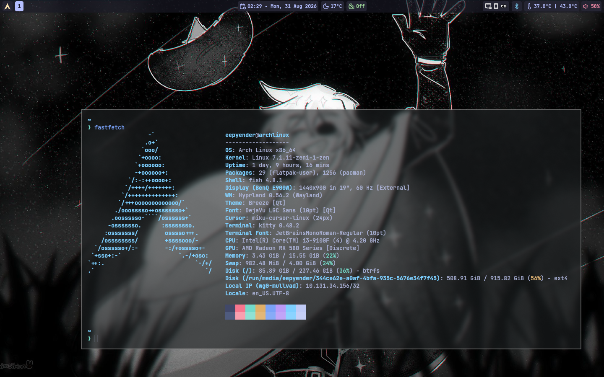
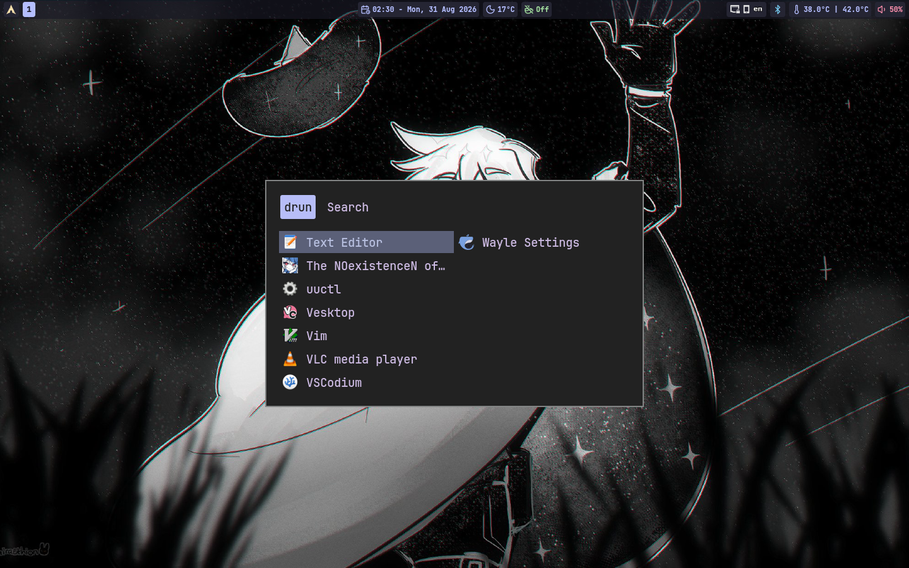
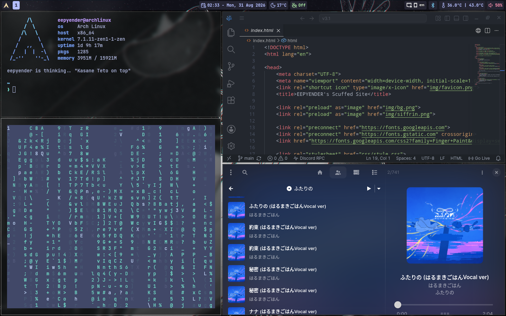

# Welcome to my hyprland dotfiles!

These are my dotfiles for my PC.

It installs things Hyprland related, cliphist, theming stuff (Qt5/6 and GTK), rofi, awww some fonts and many others from Arch repos, from AUR and flathub. It asks you if you want to install paru and if you want to install apps from AUR.

Clone this repo and run `./install.sh`

**NOTE:** This script is for archlinux and it assumes you already have Hyprland installed. Also installes Librewolf browser.

